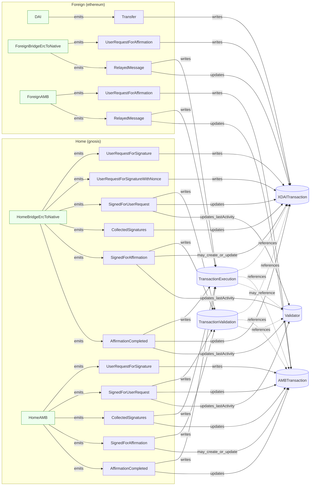
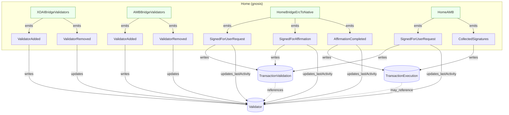

### Bridge Monitor Subgraph: Mermaid Diagram

Notes:
- Some XDAITransaction ids are `txHash` (pre-nonce flows) or `combineNonceAndChainId(nonce, chainId)`; AMBTransaction ids are `messageId`.
- TransactionExecution and TransactionValidation link back to the relevant transaction by id; Validator `lastActivity` is updated on signature/affirmation events.

### Validator Lifecycle (focused)

